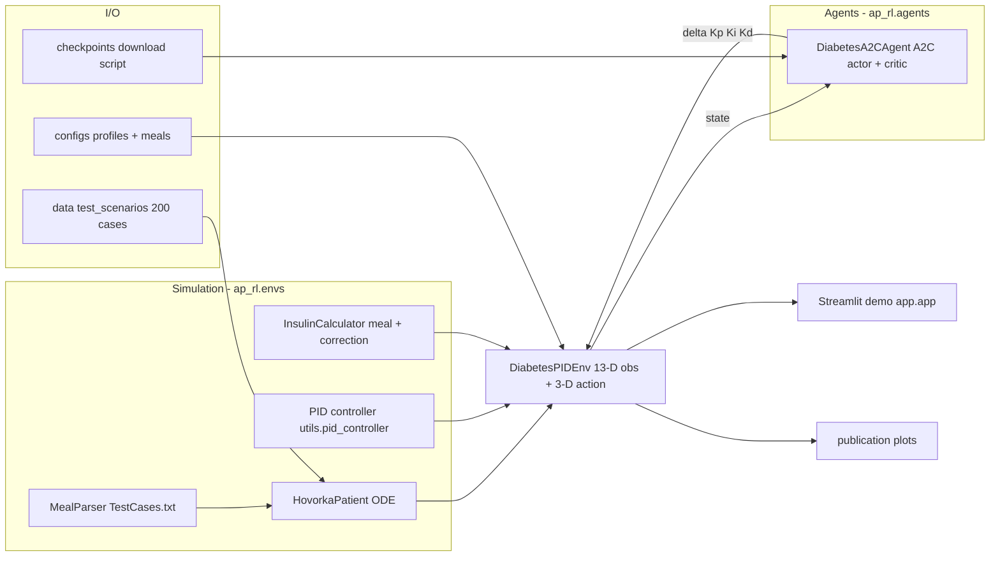

# Artificial Pancreas — RL-tuned PID Digital Twin

> [!WARNING]
> `refactor/modular-architecture` is an in-progress development baseline, not a
> production or clinical release. The Streamlit interface is deprecated and
> will be replaced by a custom frontend after the simulator and service
> contracts stabilize. Several sections below still describe the legacy
> architecture; see [`docs/phase-0-baseline.md`](docs/phase-0-baseline.md) for
> the verified branch status and known blockers.

> Synthetic Type-1 Diabetes simulator with a Reinforcement-Learning-tuned
> PID controller, a digital-twin Streamlit demo, and publication-quality
> plotting helpers. **Research / engineering demo only — not a medical
> device, not clinically validated.**

## Highlights

- **Hovorka virtual patient** ODE simulator (`ap_rl.envs.HovorkaPatient`)
  with optional Numba acceleration.
- **PID-tuning RL environment** (`ap_rl.envs.DiabetesPIDEnv`) — the A2C
  agent outputs incremental ``(ΔKp, ΔKi, ΔKd)`` updates while a meal
  bolus + correction calculator delivers prandial insulin.
- **A2C actor/critic** networks (`ap_rl.agents.DiabetesA2CAgent`) with
  weight checkpoints fetched on-demand from a GitHub Release.
- **Streamlit digital-twin demo** (`app/app.py`): patient profile +
  meal-template selector, Plotly glucose/insulin charts with shaded
  target band, heuristic linear preview, and a baseline-vs-RL overlay.
- **Synthetic patient profiles** in `configs/profiles/` covering
  insulin-sensitive / insulin-resistant / unstable / controlled
  archetypes — all clearly labelled as synthetic.
- **Publication-quality matplotlib helpers**
  (`ap_rl.visualization.publication`) for the figures in the paper /
  portfolio writeup.
- **Reproducibility**: `ap_rl.utils.seed.set_global_seed()` seeds
  Python, NumPy, and TF; `DiabetesPIDEnv(seed=...)` makes scenario
  selection and observation noise deterministic.

## Architecture


```mermaid
flowchart LR
  subgraph sim [Simulation - ap_rl.envs]
    HP[HovorkaPatient ODE]
    PID[PID controller utils.pid_controller]
    IC[InsulinCalculator meal + correction]
    MP[MealParser TestCases.txt]
  end
  subgraph rl [Agents - ap_rl.agents]
    A2C[DiabetesA2CAgent A2C actor + critic]
  end
  subgraph io [I/O]
    CFG[configs profiles + meals]
    CKPT[checkpoints download script]
    DATA[data test_scenarios 200 cases]
  end
  HP --> Env[DiabetesPIDEnv 13-D obs + 3-D action]
  PID --> Env
  IC --> Env
  MP --> HP
  CFG --> Env
  DATA --> HP
  Env -->|"state"| A2C
  A2C -->|"delta Kp Ki Kd"| Env
  CKPT --> A2C
  Env --> Demo[Streamlit demo app.app]
  Env --> Viz[publication plots]
```

## Quick start

Use **Python 3.9–3.12** for `pip install -e .` (TensorFlow does not yet support
Python 3.13 for training/inference wheels on all platforms).

```bash
# 1. Clone + install (editable)
git clone https://github.com/<your-org>/Artifical-Pancreas-Automated-RL-tuned-Controller.git
cd Artifical-Pancreas-Automated-RL-tuned-Controller
python3.11 -m venv .venv && source .venv/bin/activate   # or python3.10 / 3.12
pip install -e ".[demo,dev]"

# 2. (Optional) download trained A2C checkpoints
export AP_RL_CHECKPOINT_URL=https://github.com/<your-org>/<repo>/releases/download/v0.1.0
ap-rl-download             # or: python scripts/download_checkpoints.py

# 3. Launch the digital-twin demo
streamlit run app/app.py
# or: python demo.py

# 4. (Optional) train your own weights
ap-rl-train --preset default --seed 42
```

If you skip the `pip install -e .` step you can still run scripts and
the demo from the repo root - they prepend `src/` to `sys.path`:

```bash
PYTHONPATH=src python scripts/smoke_baseline_rollout.py
PYTHONPATH=src streamlit run app/app.py
```

## Repository layout

```
.
├── Dockerfile                 # CPU image (Python 3.11) for Streamlit demo
├── app/app.py                 # Streamlit digital-twin demo
├── demo.py                    # optional: python demo.py → streamlit run app/app.py
├── configs/
│   ├── patient_default.yaml   # canonical Hovorka parameter dict
│   ├── demo.yaml              # Streamlit defaults
│   ├── profiles/              # synthetic patient profiles (YAML)
│   └── meals/                 # deterministic meal/exercise templates
├── data/
│   └── test_scenarios/        # 200 MealData/ExerciseData cases + TestCases.txt
├── docs/
│   ├── images/                # placeholder for README / portfolio screenshots
│   ├── legacy/                # archived artificial_pancreas_simulator.py
│   ├── legacy-pid-tuner.md    # pointer to archived LunarLander PID tuner
│   └── legacy-pid-tuner/      # archived upstream LunarLander PID tuner
├── models/                    # optional local weight exports (see models/README.md)
├── checkpoints/               # gitignored; downloaded weights land here
├── scripts/
│   ├── download_checkpoints.py
│   └── smoke_baseline_rollout.py
├── src/ap_rl/
│   ├── envs/                  # HovorkaPatient + DiabetesPIDEnv + scenario builder + optional HovorkaGymEnv
│   ├── agents/                # A2C actor / critic / agent
│   ├── evaluation/            # glucose TIR / trajectory metrics (shared with env stats)
│   ├── utils/                 # PID, insulin math, paths, seed, configs
│   ├── runtime/               # framework-agnostic run_episode helper
│   ├── training/              # consolidated train_a2c with --preset CLI
│   ├── visualization/         # publication-quality matplotlib helpers
│   └── scripts/               # CLI entry points (ap-rl-download, ap-rl-train)
├── notebooks/                 # exploratory notebooks (see notebooks/README.md)
└── tests/                     # pytest suite (env, utils, viz, downloader)
```

## Hovorka Gym vs PID-tuning RL

The **primary** API for this repository is :class:`ap_rl.envs.DiabetesPIDEnv`:
a custom environment used by the TensorFlow A2C trainer where the agent
outputs PID gain deltas and insulin is computed by the PID stack plus
meal bolus rules. That path is what the Streamlit demo and
``ap_rl.training.train_a2c`` exercise end-to-end.

For experiments that prefer a Gymnasium-style loop, there is an
**optional** wrapper :class:`ap_rl.envs.HovorkaGymEnv` (same underlying
``DiabetesPIDEnv`` dynamics). It is not required for training or the
demo. Install Gymnasium with ``pip install -e ".[gym]"`` — see
``pyproject.toml`` optional dependencies.

## How RL tunes PID

The agent does **not** output insulin directly. Each minute it observes
a 13-dimensional state (normalised glucose, glucose rate, error, PID
internal terms, current gains, time-since-meal/insulin, exercise flag,
time-of-day sin/cos) and emits an incremental delta on each PID gain.
The gains are clipped to ``Kp ∈ [0.01, 2.0]``, ``Ki ∈ [0.0, 0.01]``,
``Kd ∈ [0.0, 0.1]``. Insulin delivery is then composed from:

1. **Basal**: PID output (sign-flipped, scaled) plus a TDI-derived
   baseline ``BW × 0.55 × 0.5 / 24``.
2. **Meal bolus + correction**: `InsulinCalculator` driven by the
   500 / 1500 rules, with optional `carb_ratio` / `isf` overrides per
   profile. A 15-minute lockout prevents double dosing.

The reward function — preserved verbatim from the legacy code — is
safety-first: heavy penalties for BGL < 50 or > 250, tight-band bonus
for 80–140, plus a stability bonus and a small PID-stability bonus.

## Training presets

`ap-rl-train --preset {default,robust,conservative}` consolidates the
four legacy trainers (`advanced_training.py`, `robust_training.py`,
`fixed_diabetes_trainer.py`, `simple_effective_trainer.py`) into a
single entry point. Tuned hyperparameters live in
`src/ap_rl/training/train_a2c.py::PRESETS`.

```bash
ap-rl-train --preset default --seed 42
ap-rl-train --preset robust --seed 7
ap-rl-train --preset conservative
```

Weights are written to `<repo>/checkpoints/` as
`diabetes_actor_<name>.weights.h5` / `diabetes_critic_<name>.weights.h5`
(Keras 3 ``save_weights`` format). The best episode is saved as
`diabetes_actor_best.weights.h5` automatically. Legacy ``*.h5`` files
from older runs are still loaded when present.

## Synthetic patient profiles

Switch profiles from the demo sidebar or call `load_profile(name)`
directly. All four ship in `configs/profiles/`:

| Profile             | Story                                                          |
|---------------------|----------------------------------------------------------------|
| `controlled`        | Nominal defaults; reference scenario.                          |
| `insulin_sensitive` | Tighter carb ratio, faster insulin elimination, lower TDI.     |
| `insulin_resistant` | Wider carb ratio, slower insulin action, blunted exercise rise.|
| `unstable`          | Default physiology + 5 mg/dL Gaussian sensor noise on the BGL. |

Important: the profiles are **synthetic**. They do not represent real
patients and are not appropriate for clinical decisions.

## Tests

```bash
pytest -q          # full suite (~1 s, no TF required)
pytest -v          # verbose
pytest tests/test_env_step.py -k seed_reproducibility
```

## Deployment notes

### Docker (CPU)

Build and run the Streamlit demo from the repository root (see the
[`Dockerfile`](Dockerfile) and [`.dockerignore`](.dockerignore)):

```bash
docker build -t ap-rl-demo .
docker run --rm -p 8501:8501 ap-rl-demo
# http://localhost:8501
```

Optional: mount downloaded weights or pass a release URL at runtime:

```bash
docker run --rm -p 8501:8501 -e AP_RL_CHECKPOINT_URL=https://github.com/org/repo/releases/download/v0.1.0 ap-rl-demo
```

### Hugging Face Spaces

1. Create a Streamlit space.
2. Push this repo. Spaces will install `requirements.txt` automatically.
3. Set `AP_RL_CHECKPOINT_URL` in Space secrets to a public Release URL.
4. The first cold start downloads weights into `checkpoints/`.

### Streamlit Community Cloud

1. Point the app at `app/app.py`.
2. Set `AP_RL_CHECKPOINT_URL` in Secrets if you want RL mode on first
   render.
3. Add `requirements.txt` is at the repo root — it is.

## Safety disclaimer

This simulator is intended for research, education, and engineering
portfolio demonstrations only. The synthetic patient profiles do **not**
represent real patients. The PID-tuning RL agent does not generalise to
real continuous glucose monitor or insulin pump hardware. Nothing here
should be used to make actual diabetes-management decisions.

## Acknowledgements

- **Hovorka 2004** for the underlying virtual-patient model.
- **A2C / OpenAI Spinning Up** for the actor-critic formulation.
- **IvPID** (Caner Durmusoglu, GPL-3) for the vendored PID controller.
- The legacy LunarLander RL-PID tuner under `docs/legacy-pid-tuner/`
  for the original PID-tuning RL recipe.

## License

MIT — see [`LICENSE`](LICENSE).
