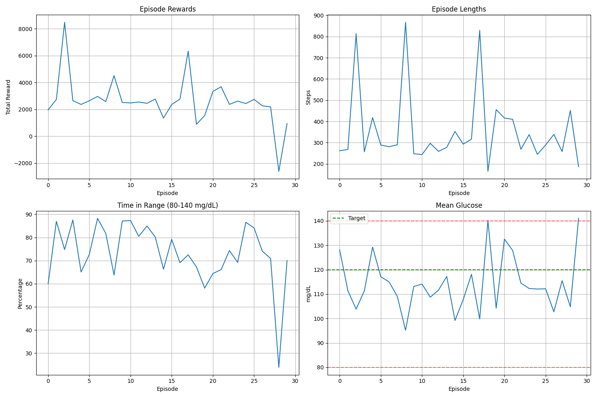

# Artificial Pancreas Automated RL-tuned Controller

A comprehensive Type 1 Diabetes management system that combines Reinforcement Learning (RL) with PID control to create an intelligent artificial pancreas. The system uses the Hovorka patient model to simulate realistic glucose-insulin dynamics and employs A2C (Advantage Actor-Critic) algorithms to automatically tune PID parameters for optimal glucose control.



## 🎯 Project Overview

This project implements an advanced artificial pancreas system that:

- **Adaptive PID Control**: Uses RL to dynamically tune Kp, Ki, Kd parameters based on patient state
- **Realistic Patient Simulation**: Implements the Hovorka model for accurate glucose-insulin dynamics
- **Intelligent Insulin Delivery**: Combines basal insulin, meal boluses, and correction doses
- **Safety-First Approach**: Includes comprehensive safety constraints and episode termination for dangerous glucose levels
- **Exercise Integration**: Accounts for exercise-induced insulin sensitivity changes
- **Meal Management**: Automated meal bolus calculation with carbohydrate counting

## 🏗️ Architecture

```
RL Agent (A2C) → PID Parameter Tuning → PID Controller → Insulin Delivery
       ↑                                        ↓
Patient State ← Hovorka Model ← Total Insulin (Basal + Bolus + Correction)
```

### Core Components

1. **Hovorka Patient Model** (`working_virtual_patient.py`)
   - Realistic Type 1 Diabetes simulation
   - Glucose-insulin dynamics modeling
   - Exercise and meal integration
   - Circadian rhythm considerations

2. **Gym Environment** (`hovorka_gym_env.py`)
   - OpenAI Gym-compatible interface
   - State observation and reward calculation
   - Episode management and safety constraints

3. **RL Controller** (`RL_Diabetes_Controller/`)
   - A2C (Advantage Actor-Critic) implementation
   - Neural network-based policy learning
   - Continuous action space for insulin rates

4. **PID Tuner** (`Reinforcement_learning_based_PID_Tuner-master/`)
   - Original RL-based PID tuning framework
   - Tested on LunarLander environment
   - Foundation for diabetes-specific implementation

5. **Simulation Engine** (`artificial_pancreas_simulator.py`)
   - Complete artificial pancreas simulation
   - Meal and exercise scenario testing
   - Performance evaluation and visualization

## 🚀 Quick Start

### Prerequisites

```bash
# Install required dependencies
pip install -r RL_Diabetes_Controller/requirements.txt
```

### Training the RL Controller

```bash
# Navigate to the A2C directory
cd RL_Diabetes_Controller/A2C/

# Start training
python diabetes_a2c_main.py
```

### Testing the Controller

```bash
# Test the trained controller
cd RL_Diabetes_Controller/envs/
python diabetes_test.py
```

### Running the Complete Simulator

```bash
# Run the artificial pancreas simulator
python artificial_pancreas_simulator.py
```

## 📊 Reward System

The RL agent learns through a sophisticated reward system:

- **Safety Violation (Episode End)**: BGL < 50 or > 250 mg/dL
- **Excellent Control (+15)**: 80-140 mg/dL (target range)
- **Good Control (+5)**: 70-79, 141-180 mg/dL (acceptable range)
- **Penalized (-10)**: BGL < 70 or > 180 mg/dL
- **Additional Penalties**: Rapid insulin changes, glucose rate of change

## 🧪 Test Scenarios

The system includes comprehensive test data:

- **100 Test Cases**: Diverse meal and exercise scenarios
- **Challenging Scenarios**: Edge cases for robust testing
- **Realistic Data**: Based on actual Type 1 Diabetes patterns

### Test Data Structure

```
TestData/
├── MealData_case1.data    # Meal timing and carbohydrate content
├── ExerciseData_case1.data # Exercise timing and intensity
└── ... (100 test cases)
```

## 📁 Project Structure

```
Artifical-Pancreas-Automated-RL-tuned-Controller/
├── artificial_pancreas_simulator.py          # Main simulation engine
├── hovorka_gym_env.py                       # Gym environment wrapper
├── working_virtual_patient.py               # Hovorka patient model
├── RL_Diabetes_Controller/                  # Main RL implementation
│   ├── A2C/                                # A2C algorithm implementation
│   │   ├── diabetes_a2c_agent.py           # Main RL agent
│   │   ├── diabetes_a2c_actor.py           # Actor network
│   │   ├── diabetes_a2c_critic.py          # Critic network
│   │   ├── diabetes_a2c_main.py            # Training script
│   │   └── save_weights/                   # Trained models
│   ├── envs/                               # Environment implementations
│   │   ├── diabetes_pid_env.py             # PID environment
│   │   └── diabetes_test.py                # Testing script
│   ├── data/test_cases/                    # Test scenarios
│   └── utils/                              # Utility functions
│       ├── insulin_calculator.py           # Bolus calculations
│       ├── meal_parser.py                  # Data parsing
│       └── pid_controller.py               # PID implementation
├── Reinforcement_learning_based_PID_Tuner-master/  # Original PID tuner
├── TestData/                               # 100 test scenarios
├── TestCaseManager/                        # Test case generation tools
└── RL_Diabetes_Integration_Package/        # Deployment package
```

## 🔧 Key Features

### Insulin Delivery System
- **Basal Insulin**: RL-tuned PID controller for continuous insulin delivery
- **Meal Bolus**: Automated calculation based on carbohydrate content
- **Correction Dose**: Additional insulin for high glucose levels
- **Safety Lockout**: 15-minute minimum interval between boluses

### Safety Constraints
- Episode termination for dangerous glucose levels
- Progressive penalty system for suboptimal control
- Insulin rate limiting and smoothing
- Comprehensive error handling

### Advanced Modeling
- **Hovorka Model**: State-of-the-art glucose-insulin dynamics
- **Exercise Integration**: Real-time insulin sensitivity adjustment
- **Circadian Rhythms**: Time-of-day effects on glucose metabolism
- **Meal Absorption**: Realistic carbohydrate absorption modeling

## 📈 Performance Metrics

The system tracks multiple performance indicators:

- **Time in Range (TIR)**: Percentage of time glucose is in target range
- **Hypoglycemia Events**: Frequency and severity of low glucose
- **Hyperglycemia Events**: Frequency and severity of high glucose
- **Insulin Efficiency**: Total insulin used vs. glucose control achieved
- **Safety Metrics**: Episode termination rates and dangerous excursions

## 🛠️ Development

### Adding New Test Cases

```bash
# Use the test case manager to generate new scenarios
cd TestCaseManager/
python t1dm_mgr_generator.py
```

### Customizing the Reward Function

Modify the reward calculation in `hovorka_gym_env.py`:

```python
def _calculate_reward(self, BGL: float, insulin_rate: float) -> float:
    # Customize reward logic here
    pass
```

### Extending the Patient Model

The Hovorka model can be extended in `working_virtual_patient.py` to include:
- Additional patient parameters
- New physiological processes
- Custom meal/exercise patterns

## 📚 Dependencies

```
tensorflow>=2.10.0
scikit-learn>=0.24.0
matplotlib>=3.5.0
numpy>=1.21.0
scipy>=1.7.0
pandas>=1.3.0
gym
```

## 🤝 Contributing

1. Fork the repository
2. Create a feature branch
3. Make your changes
4. Add tests for new functionality
5. Submit a pull request

## 📄 License

This project is licensed under the MIT License - see the LICENSE file for details.

## 🙏 Acknowledgments

- **Hovorka Model**: Based on the work of Roman Hovorka et al.
- **OpenAI Gym**: For the environment interface framework
- **A2C Algorithm**: Implementation based on the Advantage Actor-Critic paper
- **PID Control**: Foundation from the RL-based PID tuner project

## 📞 Support

For questions, issues, or contributions, please open an issue on the GitHub repository.

---

**Note**: This system is for research and educational purposes. It should not be used for actual diabetes management without proper medical supervision and regulatory approval. 